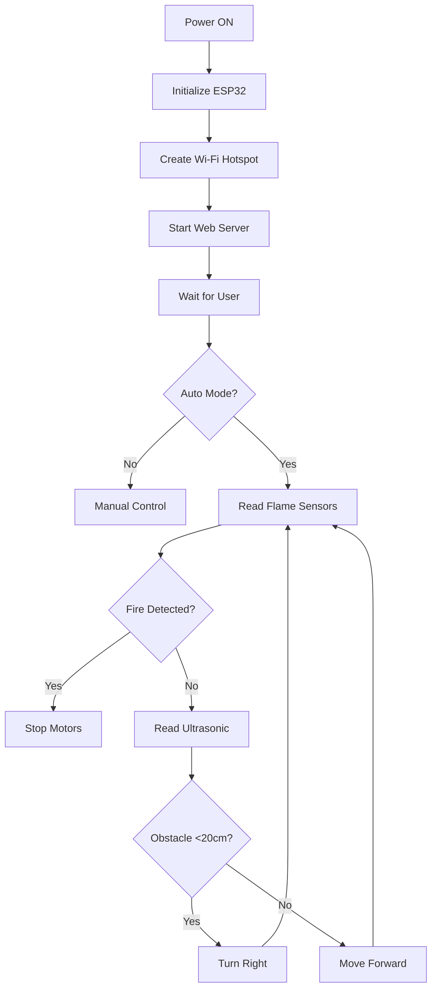
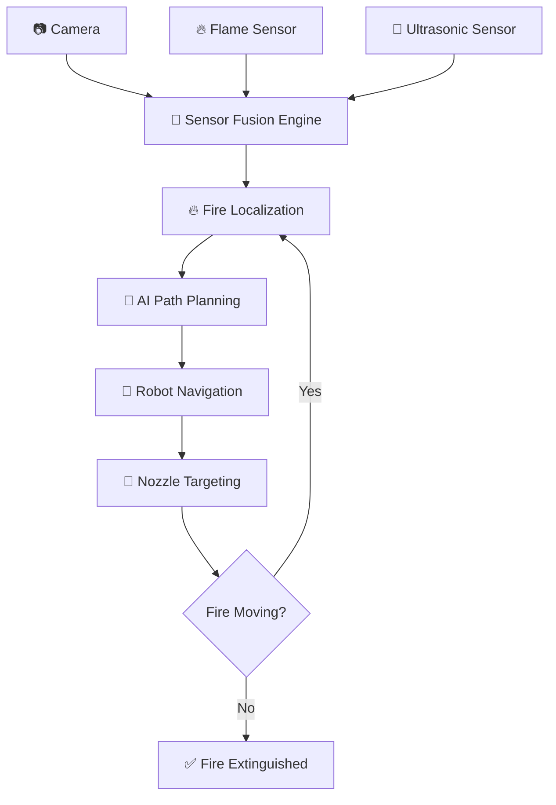
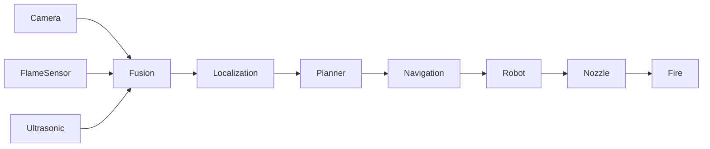
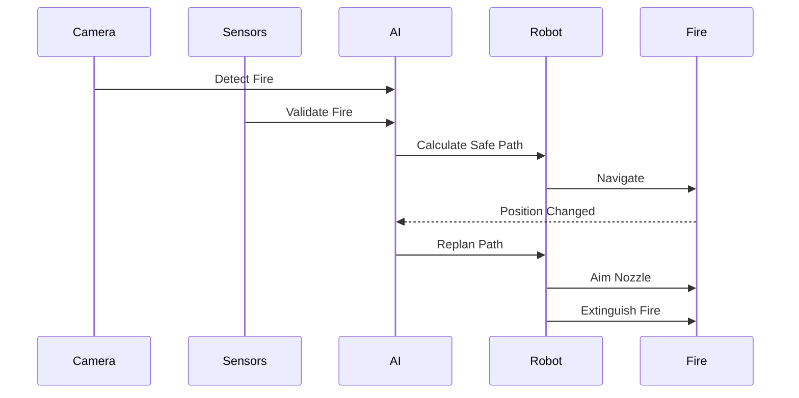
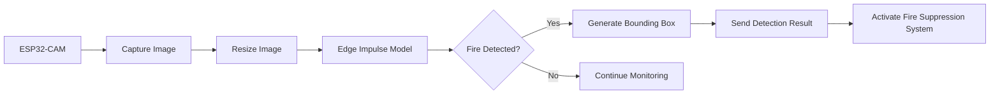
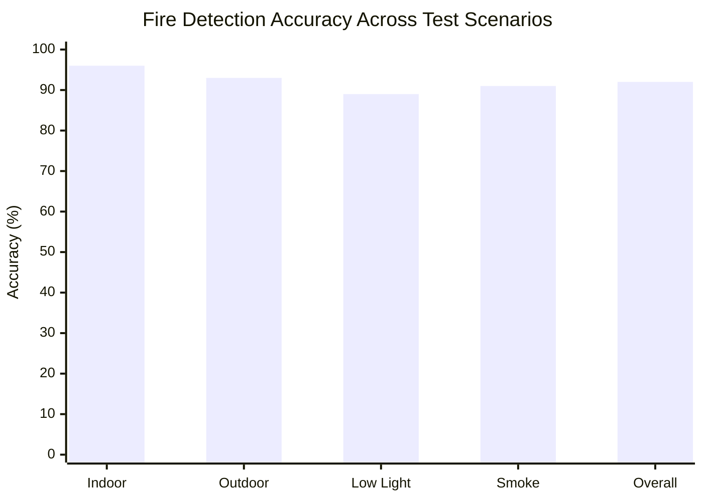

<div align="center">

# 🏆 RUSHHOUR 2026
## 24-Hour National Engineering Challenge


<br>


</div>

---

# 🏆 About RushHour

**RushHour 2026** is a **24-Hour National Engineering Challenge** that brings together passionate innovators, developers, and engineers from across the country to solve real-world problems through technology.

The hackathon provides a platform for students to transform innovative ideas into impactful solutions within a limited time. Participants collaborate as teams to design, develop, test, and present working prototypes that address practical challenges using emerging technologies.

Our team participated with the goal of building an intelligent robotic system capable of assisting firefighters and improving emergency response using **Artificial Intelligence**, **Embedded Systems**, and **Computer Vision**.

---

# 👥 Team Name

# **Avenix**

> *Engineering intelligent solutions for a safer tomorrow.*

---

# 🤖 Project Name

# **IGNIS BOT**

---

# 📖 Project Description

The **IGNIS BOT** is an intelligent robotic system developed to detect, monitor, and extinguish fire with minimal human intervention.

The robot combines **Artificial Intelligence**, **Computer Vision**, **Embedded Systems**, and **IoT** technologies to improve firefighting efficiency while reducing the risks faced by emergency responders.

Using an **ESP32-CAM** integrated with an **Edge Impulse Object Detection Model**, the robot continuously monitors its surroundings for fire. It intelligently navigates through its environment by avoiding obstacles using ultrasonic sensing and confirms fire using flame sensors.

Once a fire is detected, the robot automatically aligns a **servo-controlled water nozzle** toward the source and activates a **water pump** to extinguish the fire. The system also provides **live video streaming** and supports both **manual** and **autonomous** operation through a web-based interface, enabling users to monitor and control the robot remotely.

Our solution demonstrates how AI and robotics can work together to create safer, faster, and smarter emergency response systems.

---

# 👨‍💻 Team Details

| Team Information | Details |
|-----------------|---------|
| 🏷 Team Name | **Avenix** |
| 🏆 Hackathon | RushHour 2026 |
| 🏫 Institution | Meenakshi Sundararajan Engineering College |
| 👥 Team Size | 6 Members |

## Team Members

| No | Name | Role |
|----|------|------|
| 01 | Dharaneesh SA | Team Leader |
| 02 | Gokula Kannan S | Team Member |
| 03 | Arul Prakash S | Team Member |
| 04 | Kumaravelu S | Team Member |
| 05 | Akhilesh L | Team Member |
| 06 | Muhammad Thoufik Ansari N | Team Member |

---

# ❗ Problem Statement

Fire accidents can spread rapidly, causing severe damage to property and posing a serious risk to human lives.

Existing low-cost firefighting systems have limitations in autonomous fire detection, remote monitoring, intelligent navigation, and efficient fire suppression. These limitations often require firefighters to enter dangerous environments, increasing the risk to human life.

Our project addresses this challenge by developing an **AI-Based Autonomous Fire Suppression Robot** capable of detecting fire using computer vision, avoiding obstacles, providing live video streaming, supporting both autonomous and manual operation, and automatically extinguishing fire using a water spray mechanism.

---

# 💡 Proposed Solution

The proposed solution is an **AI-Based Autonomous Fire Suppression Robot** that integrates Artificial Intelligence, Computer Vision, Embedded Systems, and IoT technologies into a single intelligent platform.

The robot uses an **ESP32-CAM** equipped with an **Edge Impulse Object Detection Model** to detect fire in real time through computer vision. While navigating autonomously, it continuously monitors its surroundings and avoids obstacles using an ultrasonic sensor. Flame sensors provide an additional layer of verification to accurately confirm the presence of fire.

Once a fire is confirmed, a **servo-controlled water nozzle** automatically rotates toward the fire source, and a **water pump** is activated to extinguish the flames.

To enhance usability, the robot provides **live video streaming** and a **web-based control interface**, allowing users to remotely monitor and operate the system in either **manual** or **autonomous** mode.

By combining intelligent fire detection, autonomous navigation, obstacle avoidance, remote monitoring, and automated fire suppression, the proposed solution improves firefighter safety, reduces response time, and minimizes damage to both human life and property.

---

<div align="center">

### 🚀 Built with Passion by Team Avenix

**RushHour 2026 | AI • Robotics • IoT • Embedded Systems**

⭐ *Thank you for visiting our project repository!*

</div>


# 💻 Code Implementation

## 📡 Wi-Fi Access Point

```cpp
const char *ssid = "SIST-Hackathon-2026";
const char *password = "sbu123!@#";

WiFi.softAP(ssid, password);

Serial.println("WiFi Access Point Started");
Serial.println(WiFi.softAPIP());
```

---

## 🌐 Web Server Initialization

```cpp
WebServer server(80);

void setupServerRoutes() {

    server.on("/", HTTP_GET, []() {
        server.send(200, "text/html", HTTP_WEBPAGE);
    });

    server.on("/manual", HTTP_GET, []() {
        autoMode = false;
        stopMotors();
        server.send(200,"text/plain","OK");
    });

    server.on("/auto", HTTP_GET, []() {
        autoMode = true;
        server.send(200,"text/plain","OK");
    });

    server.begin();
}
```

---

## 🚗 Motor Control

```cpp
void moveForward() {

    digitalWrite(IN1, HIGH);
    digitalWrite(IN2, LOW);

    digitalWrite(IN3, HIGH);
    digitalWrite(IN4, LOW);

    botStatus = "Moving Forward";
}

void stopMotors() {

    digitalWrite(IN1, LOW);
    digitalWrite(IN2, LOW);

    digitalWrite(IN3, LOW);
    digitalWrite(IN4, LOW);

    botStatus = "Stopped";
}
```

---

## 📏 Ultrasonic Distance Measurement

```cpp
long getDistanceCM() {

    digitalWrite(TRIG_PIN, LOW);
    delayMicroseconds(2);

    digitalWrite(TRIG_PIN, HIGH);
    delayMicroseconds(10);

    digitalWrite(TRIG_PIN, LOW);

    long duration = pulseIn(ECHO_PIN, HIGH, 30000);

    if(duration == 0)
        return 999;

    return duration * 0.034 / 2;
}
```

---

## 🔥 Fire Detection

```cpp
bool isFireDetected() {

    return (

        digitalRead(FLAME_LEFT) == LOW ||

        digitalRead(FLAME_CENTER) == LOW ||

        digitalRead(FLAME_RIGHT) == LOW

    );
}
```

---

## 🤖 Autonomous Navigation

```cpp
void handleAutoMode() {

    if(isFireDetected()) {

        stopMotors();

        botStatus = "🔥 FIRE DETECTED!";

        return;
    }

    long distance = getDistanceCM();

    if(distance < 20) {

        stopMotors();

        delay(200);

        turnRight();

        delay(400);

    }

    else {

        moveForward();

        botStatus = "Auto Navigating...";
    }
}
```

---

## 🔄 Main Loop

```cpp
void loop() {

    server.handleClient();

    if(autoMode) {

        handleAutoMode();

    }
}
```

---

## 📊 Program Flow




<div align="center">

# 🚨 ZEROTH HOUR 🚨

### 🔥 *Adaptive Fire Source Localization & Intelligent Path Planning Engine*


<br>


<br><br>


</div>

---

## 🎯 Motto

> **"Every Second Counts. Every Decision Saves Lives."**

---

# 🔥 Adaptive Fire Source Localization & Path Planning Engine

<div align="center">


### 🚒 Intelligent Fire Detection • Dynamic Path Planning • Autonomous Navigation

</div>

---

# 📌 Problem Statement

Design an **AI-powered real-time navigation engine** that can:

- 🔥 Detect and localize moving fire sources.
- 📷 Fuse Camera, Flame Sensor & Ultrasonic Sensor data.
- 🧠 Compute the safest path automatically.
- 🚗 Dynamically replan navigation when obstacles appear.
- 🎯 Continuously adjust nozzle aiming.
- ⚡ Achieve all of the above **without adding new hardware**.

---

# ✨ Our Solution

Our solution combines **Sensor Fusion + Artificial Intelligence + Dynamic Path Planning** into a single autonomous decision engine.

Instead of relying on only one sensor, the robot continuously fuses information from:

- 📷 Camera
- 🔥 Flame Sensor
- 📡 Ultrasonic Sensor

The AI estimates the exact fire location, predicts movement, avoids obstacles, and continuously updates the navigation path in real time.

---

# 🚀 System Workflow



---

# ⚙️ AI Decision Pipeline

```text
Camera Frame
      │
      ▼
Fire Detection (YOLO / OpenCV)
      │
      ▼
Flame Sensor Validation
      │
      ▼
Ultrasonic Obstacle Mapping
      │
      ▼
Sensor Fusion
      │
      ▼
Fire Coordinate Estimation
      │
      ▼
A* / Dijkstra Path Planning
      │
      ▼
Real-Time Navigation
      │
      ▼
Dynamic Replanning
      │
      ▼
Nozzle Alignment
```

---

# 🧠 Core Features

### 🔥 Fire Source Localization

- Detects fire using computer vision.
- Confirms detection using flame sensor.
- Calculates precise fire coordinates.

---

### 📡 Sensor Fusion

Combines data from:

- Camera
- Flame Sensor
- Ultrasonic Sensor

This improves accuracy and reduces false detections.

---

### 🚗 Dynamic Path Planning

The robot computes the safest path by considering:

- Obstacles
- Fire position
- Robot orientation
- Safe distance

If the environment changes, the path is recalculated instantly.

---

### 🎯 Intelligent Nozzle Targeting

Once the robot reaches the target,

- predicts fire movement,
- aligns nozzle automatically,
- continuously adjusts aiming.

---

### ⚡ Real-Time Replanning

Whenever:

- obstacle detected
- fire moves
- robot deviates

the navigation algorithm immediately generates a new optimal path.

---

# 🏗 System Architecture



---

# 🛠 Technologies

| Module | Technology |
|---------|------------|
| Fire Detection | OpenCV / YOLO |
| Sensor Fusion | AI Decision Engine |
| Navigation | A* Path Planning |
| Obstacle Detection | Ultrasonic Sensor |
| Localization | Camera + Flame Sensor |
| Robot Control | Arduino / ESP32 |
| Programming | Python + C++ |

---

# 🎯 Advantages

✅ No additional hardware required

✅ Real-time fire localization

✅ Intelligent sensor fusion

✅ Dynamic obstacle avoidance

✅ Continuous path replanning

✅ Autonomous nozzle targeting

✅ Faster fire response

---

# 📈 Future Improvements

- 🔥 Thermal Camera Integration
- 🤖 Reinforcement Learning Navigation
- 🛰 Multi-Robot Collaboration
- ☁ Cloud Monitoring Dashboard
- 📱 Mobile App Control
- 📊 AI Fire Prediction

---

# 🎬 Project Overview



---

<div align="center">

## 🚒 Smart • Adaptive • Autonomous

### **"Detect → Localize → Navigate → Replan → Extinguish"**

⭐ Built for Hackathon Innovation ⭐

</div>

# 🧠 AI & Machine Learning Engine

<div align="center">


<h3>🚀 Intelligent Fire Detection Powered by Machine Learning</h3>

<p>
The <b>Adaptive Fire Source Localization and Path Planning Engine</b> uses
<b>Machine Learning</b> to analyze real-time data from the <b>camera</b>,
<b>flame sensor</b>, and <b>ultrasonic sensor</b>. By fusing multiple sensor inputs,
the AI accurately identifies fire locations, predicts movement, detects obstacles,
and computes the safest navigation path. The system continuously replans its route
and precisely aligns the water nozzle, enabling fast and reliable fire suppression
without requiring any additional hardware.
</p>


</div>


> **"See • Analyze • Decide • Navigate • Extinguish"** 🔥🤖


# 🧠 Machine Learning Model

Our project leverages **Edge Impulse** to deploy an optimized object detection model on the **ESP32-CAM**.

### Dataset Preparation

- 📷 Fire Images
- 🌳 Non-Fire Images
- 🔥 Indoor Fire
- 🌲 Outdoor Fire
- 💡 Different Lighting Conditions

### Training Pipeline

```text
Image Collection
        │
        ▼
Data Annotation
        │
        ▼
Data Augmentation
        │
        ▼
Model Training (FOMO Object Detection)
        │
        ▼
Model Validation
        │
        ▼
Edge Impulse Deployment
        │
        ▼
ESP32-CAM Inference
```

### Model Workflow



### Inference Process

1. Capture image using ESP32-CAM.
2. Convert the captured image into RGB888 format.
3. Resize the image to match the model input size.
4. Execute the Edge Impulse object detection model.
5. Detect fire and generate bounding boxes.
6. Send the detection result to the robot controller.
7. Trigger the fire suppression mechanism if fire is confirmed.

   ## 📊 ESP32-CAM Fire Detection Accuracy

> **Note:** Replace these example values with your actual evaluation results if available.


## 📸 Project Progress


